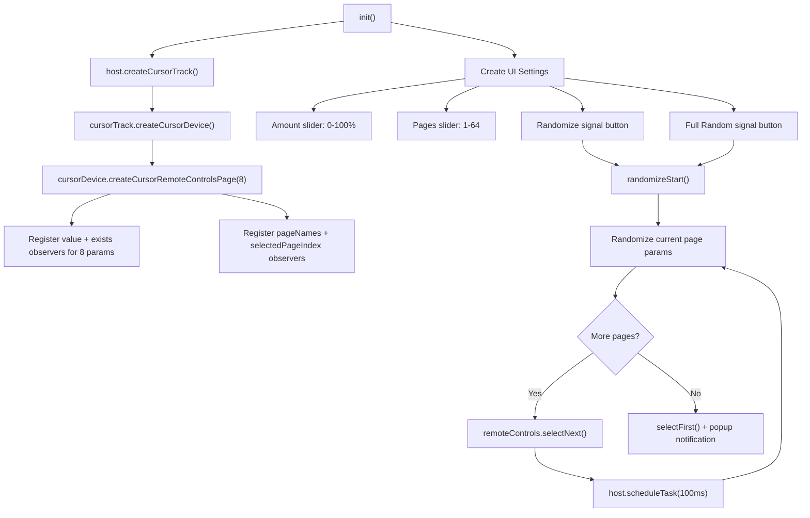

# Bitwig Plugin Parameter Randomizer

## Context

You already have a basic randomizer at `~/Bitwig Studio/Controller Scripts/PluginPumper.control.js` that does full-random across 8 pages (64 params) but lacks an amount control. The goal is a new, more capable script.

A `.control.js` JavaScript controller script is the right approach here -- no need for a Java `.bwextension`. The Bitwig Controller Script API provides everything needed: `CursorDevice`, `CursorRemoteControlsPage`, parameter observers, and UI settings via `getDocumentState()`.

## Script: `PluginRandomizer.control.js`

**Install location:** `~/Bitwig Studio/Controller Scripts/PluginRandomizer.control.js`
**Working copy (for version control):** `/home/stoo/code/ai/Plugins/PluginRandomizer.control.js`

## Architecture



## Key Design Decisions

- **Scheduled page traversal**: After switching remote control pages with `selectNext()`, the parameter value observers need time to update. Use `host.scheduleTask(callback, delayMs)` with ~100ms delays between pages so observed values are fresh before applying the randomization formula.

- **Amount formula** (deviation from current value):
  ```
  deviation = (Math.random() * 2 - 1) * (amount / 100)
  newValue = clamp(currentValue + deviation, 0.0, 1.0)
  ```
  - At **100%**: params can swing the full range from their current position
  - At **50%**: params deviate up to +/-50% from current
  - At **0%**: no change

- **"Full Random" button**: Ignores current values entirely, sets each param to `Math.random()`. Useful for completely new sounds.

- **Parameter existence check**: Only randomize parameters where `.exists()` is true (avoids writing to empty remote control slots).

- **Return to original page**: After randomizing all pages, navigate back to the page the user was on.

## UI Settings (appear in Controller panel)

| Setting | Type | Range | Default | Purpose |
|---|---|---|---|---|
| Amount | Number slider | 0-100% | 50 | Deviation strength from current values |
| Pages | Number slider | 1-64 | 8 | How many RC pages to randomize |
| Randomize | Signal button | -- | -- | Applies deviation-based randomization |
| Full Random | Signal button | -- | -- | Sets all params to pure random values |

## API Methods Used

- `host.createCursorTrack(0, 0)` -- follows selected track, no sends/scenes needed
- `cursorTrack.createCursorDevice()` -- follows selected device on that track
- `cursorDevice.createCursorRemoteControlsPage(8)` -- 8 params per page (API max)
- `remoteControls.getParameter(i).value().addValueObserver(cb)` -- track current values
- `remoteControls.getParameter(i).exists().addValueObserver(cb)` -- track which slots are mapped
- `remoteControls.pageNames().addValueObserver(cb)` -- get total page count
- `remoteControls.selectedPageIndex().addValueObserver(cb)` -- track current page
- `remoteControls.getParameter(i).set(value)` -- set normalized 0.0-1.0
- `remoteControls.selectNext()` / `selectFirst()` -- navigate pages
- `host.scheduleTask(callback, delayMs)` -- async scheduling for page traversal
- `host.getDocumentState().getNumberSetting(...)` -- UI slider
- `host.getDocumentState().getSignalSetting(...)` -- UI button

## Compatibility

Works with any plugin type (VST2/VST3/CLAP, synth or FX) because it operates on Bitwig's Remote Controls abstraction layer, not plugin-specific APIs. Whatever parameters Bitwig exposes in the dock/remote controls panel will be randomized.
